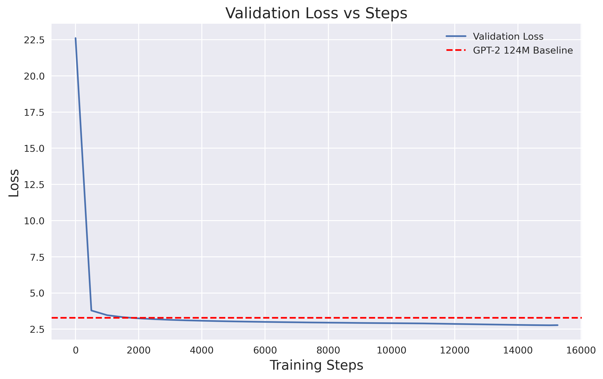
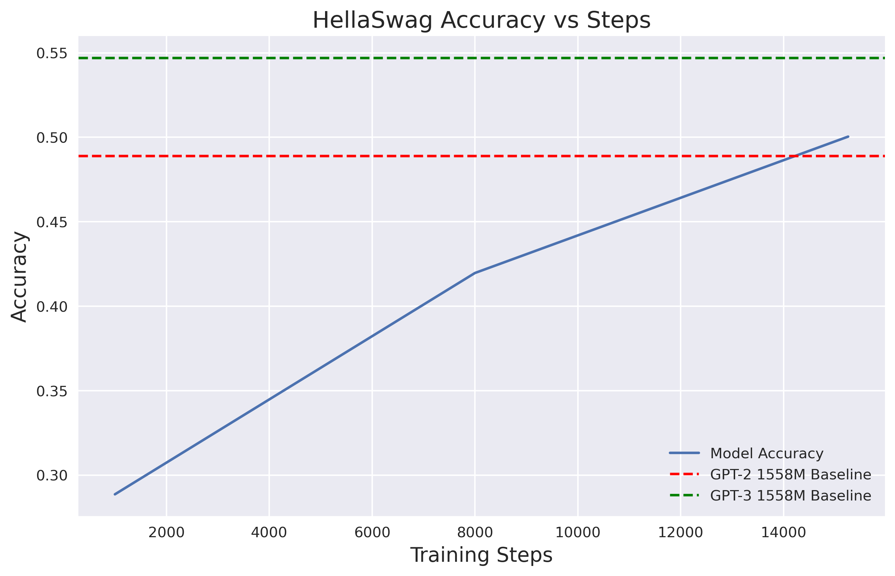

# G(houlish) P(retrained) T(errifier) 🎃
In this project, I wanted to explore building and training my own GPT-2-level LLM, inspired by [Karpathy](https://www.youtube.com/watch?v=l8pRSuU81PU). My goal was to go through all the steps—from building something really small-scale to get a feel for transformers, to running a large-scale pre-training, and finally fine-tuning with some 'light' or 'pseudo' reinforcement learning with human feedback (RLHF).

I'm particularly interested in fine-tuning and RLHF for various niche domains. Since I’m releasing this on Halloween, I chose to fine-tune the model for scary stories as a fun example. But ultimately, my hope was to understand LLMs better, learn how to handle pre-training at scale, and get a sense of how fine-tuning and RLHF work—even at a smaller scale.

To this end, I think I was fairly successful. I managed to write and pre-train a 1.5-billion parameter GPT (full GPT-2 structure) from scratch, which outperformed OpenAI’s GPT-2 (50.1% vs. 48.9%—GPT-3 is at 54.7%) on the challenging [HellaSwag](https://rowanzellers.com/hellaswag/) dataset. I achieved this by distributing training across 8 H100 GPUs. The fine-tuning and RLHF were more subjective, and I wouldn’t say they went as well as I’d hoped, but I’ve gained a much clearer understanding of the process. Renting H100s on Lambda isn’t cheap, so for now, I’m satisfied with these results.

This codebase contains everything I used for all three steps, and I aimed to make it pretty readable with types and a modular design. I’ve also provided abstract classes to help make it relatively easy to plug and play different datasets or ideas.

From a research perspective, I’d really like to explore some ideas on the architecture/pre-training side, as well as conduct a more full-scale RLHF run to test out some new approaches. On the application side, I’m also interested in applying these methods to other domains (maybe something more useful than scary stories 👻).

If you have any ideas (or H100s), let me know!

Here’s a [link](https://neuron-by-neuron.ghost.io/g-houlish-p-retrained-t-errifier-or-training-my-own-gpt-pretraining-finetuning-rlhf-to-generate-scary-stories-for-halloween-2/) to the blog post.


## Sources 
I wanted to make sure to include this at the top: while the structure of this codebase is unique to me, the core underlying methods (distributed training, transformer architecture, evaluation, etc.) were, of course, heavily inspired by [Karpathy's implementation](https://github.com/karpathy/nanoGPT) and [Keller Jordan's implementation](https://github.com/KellerJordan/modded-nanogpt), which explores various optimizations to speed up training.

As a learning exercise—and to restructure things—I did rewrite everything, but the core functionality is essentially adapted from their work.


## Installation

1. Clone the repository
2. Install dependencies:
```
pip install -r requirements.txt
```

## Project Structure
There are really four key parts of the project:
- Testing: Initial tests I wrote to build my own tokenizer, bigram model, and a small transformer.
- Pre-Training: Distributed training of a large (1.5 billion) transformer on the FineWeb dataset.
- Fine-Tuning: Training the output of the previous step on a dataset of 8 million tokens of creepy pasta stories.
- RLHF: This is more of a pseudo RLHF—GPT-4 acts as a stand-in for human feedback, and the "reinforcement learning" is essentially another fine-tuning step.

I’ll walk through each of these steps, highlighting how to use the codebase.

### Testing 
In testing, I built a tokenization model for the creepy pasta dataset and practiced training a Bigram and small transformer model on it. Full outputs can be seen in the blog. I also experimented with some minor architecture changes (all of these settings can be adjusted and explored with argparse). Here’s how you would run the transformer training:
```
python testing.py --gpt_model
```
Here is an example output at this stage: 
``` as iny damaginly on the room! I was than the piekle conded to so the emelus of with about into knowlywhat, Tholpolated those plazer: Plook up sonly belarget, frigixped my more that night has parmauss two quicked it was sleeped at think her thought? Prack you cut pouing and me. I used... ```

### Pre-Training 
At this stage, I used the `Fineweb` dataset. All data preparation scripts can be found in `data/`, and the dataloaders are in `datasets.py`. I hope the abstract class there clarifies how to add your own datasets.

For this stage, I used the 1.5B transformer—setup details are in `models.py`. By configuring the number of heads, embedding size, etc., you can set the model’s size and structure.

Most of the project code is in `utils.py` (maybe I should refactor this?). Here, you'll find `setup_distributed_training()`, which configures the distributed environment dictionary the rest of the code uses to set up distributed training if needed. It also works on a single GPU, setting configurations automatically.

In `utils.py`, you’ll also find the training and evaluation code, as well as checkpoint saving/loading. Optionally, logging can be done through Weights and Biases, but all logs are also saved as JSON files in the log folder.

To run the code on a single GPU, the command might look something like this:

```
python main_pretrain.py --dataset fineweb --total_batch_size 491520 --batch_size 12 --max_steps 15258 --learning_rate 0.0018 --warmdown_iters 4359 --model_name gpt2full
```

And to run distributed over 8 GPUs would look like: 
```
PYTORCH_CUDA_ALLOC_CONF=expandable_segments:True torchrun --standalone --nproc_per_node=8 main_pretrain.py --dataset fineweb --total_batch_size 491520 --batch_size 12 --max_steps 15258 --learning_rate 0.0018 --warmdown_iters 4359 --model_name gpt2full
```
Both of these commands can also be found in `scripts/`. 
The full set of arguments can be seen in `main_pretrain.py` - but these options train the 1.5B model to give the results I share here and in the blog. With 8 H100 GPUs this takes about 8.5 hours for me to run. 

### FineTuning 
At this stage, I fine-tuned on the CreepyPasta dataset, which contains ~8.5 million tokens. While there’s definitely room for optimizing hyperparameters, I kept it relatively simple by halving the learning rate and training for three iterations over the entire dataset. Most of the code is still contained in `utils.py` and follows the same structure; the only real difference here is that the code expects a checkpoint to be provided.

Here’s how to run fine-tuning:
```
python main_finetune.py --dataset creepypasta --total_batch_size 491520 --batch_size 12 --max_steps 50 --learning_rate 0.00018 --warmdown_iters 10 --model_name gpt2full  --base_model output/step_15256/checkpoint.pt
```
This resumes from the last step of the pre-training (and can also be found in `scripts/`).

### RLHF 
This part is one of the areas I’m most interested in, but unfortunately, by this stage, my LambdaLabs bill was getting a bit intimidating. So I opted for more of an approximation of RLHF to get a feel for it. Here’s what I did: 1) generated 400 stories from the fine-tuned model, 2) grouped these into 100 batches of 4 and had GPT-4o select the scariest story in each batch (simulating a human ranking), and 3) briefly fine-tuned on the 100 scariest stories.

I think all but the last step are pretty reasonable approaches—it would have been interesting to train a model to automate the ranking process and then use PPO.

The first two steps can be done with `main_rlhf.py` you can generate stories with:

```
python main_rlhf.py --output_folder rlfh_out --checkpoint_path fine_tune_output/step_50/model.pt --generate_stories
```
Which will generate and save in json the 400 stories. 

Then by running:
```
python main_rlhf.py --output_folder rlfh_out --checkpoint_path fine_tune_output/step_50/model.pt --get_gpt_ranking
```
Will call GPT-4o to get and save the rankings, and generate the output text file I use to finetune. 

Then lastly, by calling:
```
python main_finetune.py --dataset rlhf --total_batch_size 2048 --batch_size 2 --max_steps 3 --learning_rate 0.00018 --warmdown_iters 0 --model_name gpt2full  --base_model fine_tune_output/step_50/model.pt --output_dir rlfh_out
```

This will fine-tune the model on these scariest stories.

### Other scripts. 
`eval_pretrain.py` -- helps analyze the evaluation accuracy of different checkpoints 
`generate_stories.py` -- generates stories from a given checkpoints 
`muon.py` -- implements the muon optimizer (from Keller) 
`tokenizers.py` -- implements tokenization class - uses GPT-2 - but in theory you could implement anything else. 


## Saved model 
The produced model checkpoint is on HuggingFace [here](https://huggingface.co/bhogan/ghoulish_pretrained_terrifier).

### Results 
Here is an example generation of the final model:

`It was a dark and stormy night \u00c2 and when we walked up the stairs it was pitch dark.\u201d\nMr. Wessels said he found her still standing and unresponsive inside the house but police were unable to revive her.\nHis next to last memory of Ms. O\u2019Neill is of her kissing him on the cheek and walking away from him with another man.`

Here is the validation curve (with the 124M GPT-2 loss - idk what the 1.5B loss was): 

Here is the hellaswag curve (with the 1.5B GPT-2 and GPT-3 acc): 



### Datasets
The model leverages the Fineweb dataset for pretraining (processed via `prepare_fineweb.py`) and validates against the HellaSwag benchmark (`hellaswag.py`).

Finetuning utilizes the curated [CreepyPasta Dataset](https://www.kaggle.com/datasets/thomaskonstantin/3500-popular-creepypastas) comprising 3,500 high-quality horror narratives.


## Contributing
I hope the code is friendly to augmenting with new datasets and methods, feel free to contribute or message me about any new feature etc. 

## License

This project is distributed under the MIT License - see LICENSE for details.
