# G(houlish) P(retrained) T(errifier) 🎃

# May 2026 update — further experiments

After GRPO I wanted to keep going on this repo and try out a few newer ideas while keeping the implementation as readable as possible. The original codebase is small and dependency-light on purpose — anyone can read every file front to back in an afternoon — and I wanted these add-ons to feel the same way. Each new architecture sits behind a CLI flag so the original commands keep producing the exact same model.

Three experiments planned, in order:

1. **Mixture of Experts (MoE)** — done, write-up below.
2. **Attention Residuals** — done, write-up below.
3. **Adaptive depth** (per-token soft routing over layer outputs, with a compute-cost penalty) — done, write-up below.

The setup for every experiment is the same controlled comparison: train a dense baseline and the modified architecture for the same number of steps on the same data on a single H100 (capped at ~2h of wall time for the dense run), then compare validation loss curves and run a deeper analysis of whatever the new mechanism is doing.

---

## Experiment 1 — Mixture of Experts

### What MoE is, briefly

A dense transformer applies the **same** feed-forward network to every token. MoE replaces that single FFN with N small "expert" FFNs and a tiny linear "router" that, for each token, picks the top-k experts and blends their outputs. Total model parameters can stay the same (split one FFN into N smaller ones), but each token now does FFN compute on only a subset of the experts. The hope: experts specialize on different kinds of tokens, the router learns to dispatch correctly, and you get more model capacity per FLOP than dense.

The standard failure mode is **router collapse** — the router learns to always pick the same expert, the others go dead, and you've just made the model worse. The standard fix is an **auxiliary load-balancing loss** added to the main objective that penalizes uneven expert utilization. We use the Switch Transformer form.

### Implementation

Everything lives in [`models.py`](models.py) right next to the original `FeedForward` class — the new `MixtureOfExperts` block is about 70 lines including comments. The toggle is `--use_moe` on the existing `main_pretrain.py`; the default (off) path is byte-for-byte unchanged from the October 2025 code.

Config used for the experiment:
- `gpt2small` (12 layers, 768 dim, 124M params)
- 4 experts per layer, top-2 routing
- Each expert's hidden size = `4d / num_experts = d`, so total FFN params equal one dense FFN — **same total parameter count as dense**
- Switch-style aux loss with weight 0.01
- Same hyperparameters as dense baseline: 5100 steps, total_batch_size = 524288 tokens, lr = 0.0036

A note on per-step compute: with each expert at `1/N` the hidden size and top-k=2 of 4, each token does **half the FFN FLOPs of dense**. So at equal params, MoE is doing less compute per token; the experiment really asks "does the router's added flexibility make up for halved FFN compute?"

Run commands:
```
# dense baseline
sbatch scripts/pretrain_dense.sbatch

# MoE
sbatch scripts/pretrain_moe.sbatch
```

### Results: loss curves

Both runs completed all 5100 steps on a single H100. Dense took ~92 minutes, MoE ~211 minutes (the slower MoE wall-clock is the naïve per-expert Python loop in the forward pass, not a fundamental FLOPs gap — proper kernels like MegaBlocks would close most of it).

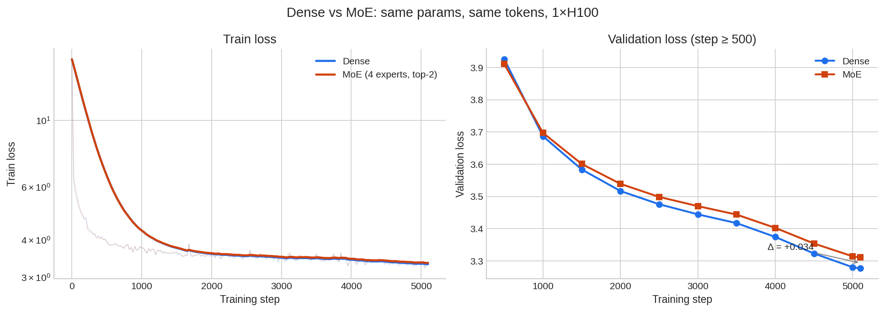

| Step | Dense val | MoE val | Δ |
|---|---|---|---|
| 500 | 3.926 | **3.911** | -0.015 |
| 1000 | 3.687 | 3.697 | +0.010 |
| 2000 | 3.517 | 3.539 | +0.022 |
| 3000 | 3.444 | 3.470 | +0.026 |
| 4000 | 3.374 | 3.402 | +0.028 |
| 5099 | **3.277** | **3.311** | +0.034 |

MoE was slightly ahead at step 500 then dense pulled away monotonically — final gap of +0.034 (≈1% in perplexity space). The curves are remarkably parallel through the middle of training, with the gap creeping up by about +0.001 per 500 steps. So **MoE matches dense within ~1% perplexity at exactly the same parameter count and step budget, with ~half the FFN FLOPs per token plus an aux-loss regularizer fighting the main loss**. At this scale (124M params, 2.7B tokens), the capacity-via-routing trade buys back almost — but not quite — the compute it gives up.

### Routing health: balanced, never collapses

The aux loss visibly works. Below: per-layer expert utilization at four snapshots through training.

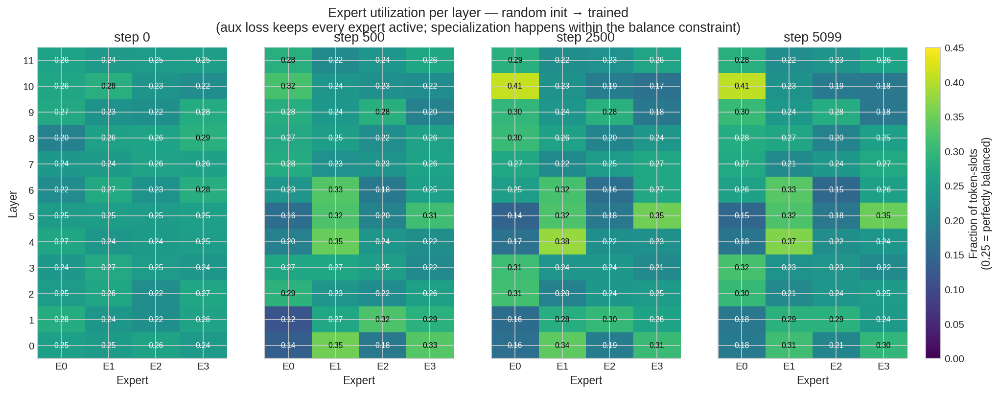

At step 0 (random init) every expert at every layer gets ~25% of the traffic — that's just random routing. After training, traffic still stays within roughly 0.15–0.41 per expert (never goes to zero, never dominates). Aux loss kept every expert active, and the router learned non-trivial routing decisions inside that balance constraint.

The same story in two scalar metrics over training:

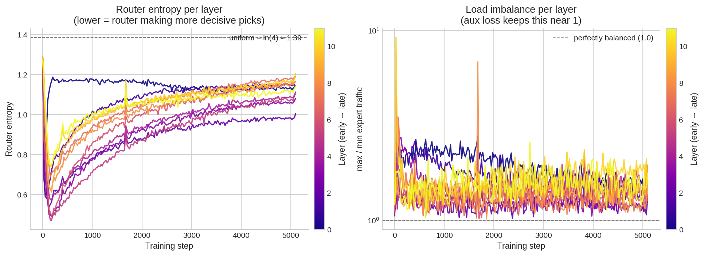

- **Left**: router entropy per layer over training. Lower = router making more decisive top-k picks. Late layers (yellow) drop fastest and lowest (~0.6 vs the uniform max of ln(4) ≈ 1.39), early layers (purple) stay closer to uniform. Specialization emerges most strongly in the deeper half of the network.
- **Right**: load imbalance (max/min expert traffic). At random init a few layers are very imbalanced (>10×); within a few hundred steps the aux loss has clamped every layer to about 1.2–2.5× imbalance and held it there for the rest of training.

### Where the specialization actually shows up

Looking at the final checkpoint, for each (layer, expert), what are the most common tokens routed there? Mostly the same handful of high-frequency English function words show up everywhere (because they ARE everywhere), but a few experts at specific layers show real specialization:

- **Layer 6 / E2** — almost exclusively punctuation/structural tokens (`.` `,` `\n` `-` `(` `:` `"` `?`)
- **Layer 8 / E1** — copulas and auxiliaries (` is` ` be` ` are` ` was` ` has` ` will` ` been`)
- **Layer 11 / E3** — pronouns/subjects (` it` ` that` ` I` ` you` ` we` ` they` ` he` ` who`)
- **Layer 11 / E1** — rare/numeric/named-entity tokens (` data` ` 2012` ` 2013` ` computer` ` time` `S`)

The most decisive routes at layer 11, sorted by how concentrated each token's routing is:

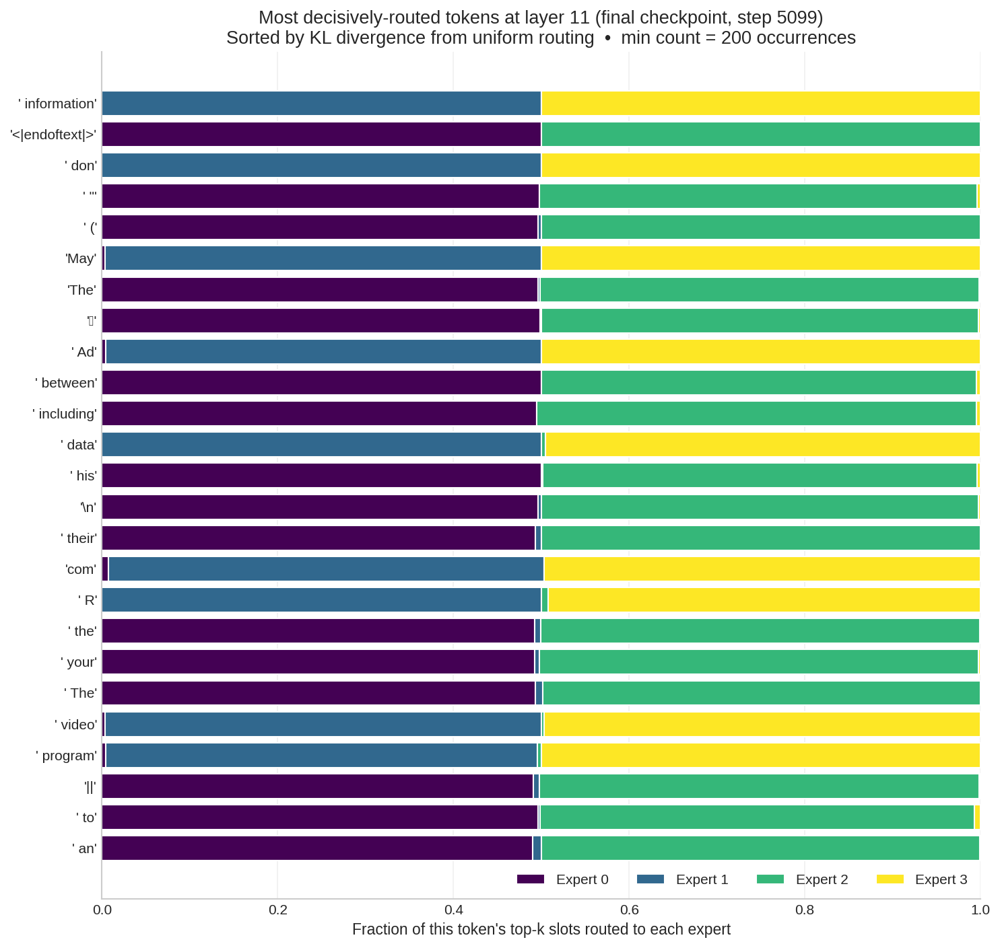

Two notable patterns:
1. Every bar is ~50/50 between **two** experts. That's because top-k=2 means each token-occurrence visits exactly 2 experts — so "decisive routing" doesn't mean one expert, it means a deterministic *pair*.
2. At layer 11 most of the bars are dominated by the `{E0, E2}` pair (green); a smaller cluster routes through `{E1, E3}` (blue+yellow). The router has effectively partitioned the four experts into two functional pairs at this depth, with `{E0, E2}` handling function words and structural tokens, and `{E1, E3}` handling content-y/named-entity tokens.

### Is the router context-aware or just a lookup table?

The big question for any MoE analysis: when the SAME token type appears in different sentences, does it route to different experts? If routing depends only on token identity, the router is a fancy embedding lookup and most of the "specialization" story collapses. If routing varies with context, the router is reading semantic information from the residual stream and the experts really are doing context-sensitive work.

For each token type with ≥500 occurrences in a 262K-token validation probe, I computed the entropy of its expert-pair choice across occurrences. Zero entropy = same pair every time (deterministic), high entropy = spread across pairs (context-dependent). Max possible is log2(6) ≈ 2.585 bits.

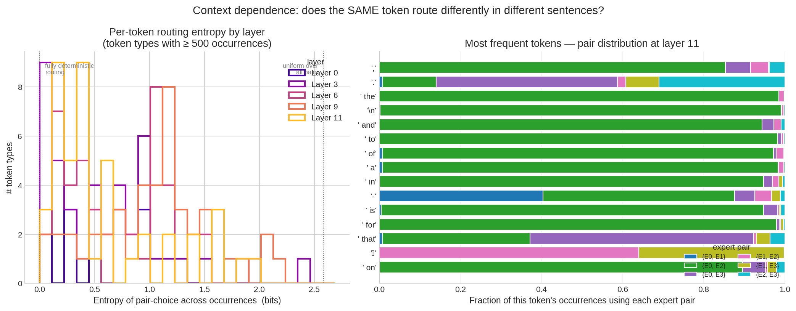

Per-layer mean entropy across token types:

| Layer | Mean entropy (bits) |
|---|---|
| 0 | 0.32 |
| 3 | 0.57 |
| 6 | 0.72 |
| 8 | 1.05 |
| 9 | 1.03 |
| 10 | **1.26** |
| 11 | 0.62 |

Three things pop out:
1. **Routing is mostly deterministic at the early layers (entropy ≈ 0.3–0.6).** The router at layer 0 is basically a fancy lookup over token embeddings — same token type → same expert pair, almost regardless of context.
2. **Routing becomes meaningfully context-dependent in the late-middle of the network (layers 8–10, entropy ≈ 1.0–1.3).** This is where the residual stream has accumulated enough higher-level information for the same surface token to route differently in different surrounding sentences.
3. **Layer 11 drops back to deterministic.** By the final layer the model has crystallized into a "what kind of token is this" decision; context has already been used.

So the answer to "is the router context-aware?" is *yes, but mostly in a specific band of layers*. The lookup-table criticism is fair for the early layers and unfair for the deeper ones.

### Token paths through the experts

One more view: for a few sample sentences from the validation probe, trace each token's top-1 expert at every layer. Each row of the heatmap is a layer (0 at bottom, 11 at top), each column is a token, cell color is which of the four experts that token visited first at that layer.

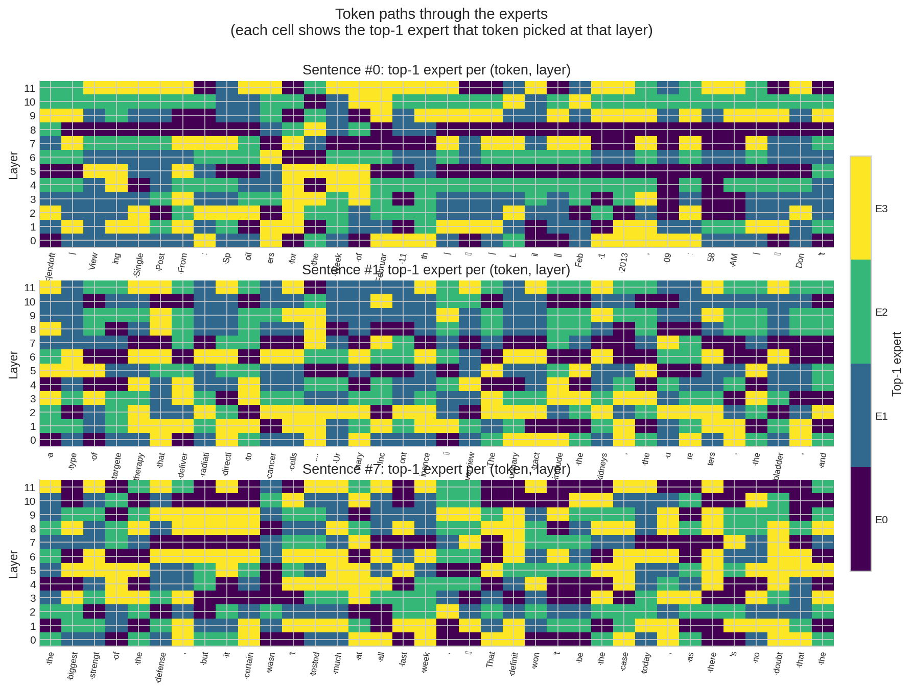

You can see vertical "highway" stripes — the same expert reused across many consecutive tokens — especially in the middle layers, where the router's choice is more about local syntactic context than the specific token. Late layers (top rows) look more dappled, with the choice depending more strongly on the token type. Different sentences produce visibly different path patterns, which is the picture-version of the context-dependence finding above.

### Expert ablation — which experts are load-bearing?

To get a direct causal handle on which experts matter, I took the trained checkpoint and, for each (layer, expert) of the 12 × 4 = 48 combinations, masked that expert's router logit to −∞ at inference (so the top-k can never pick it), then measured the val loss on a 30-batch fixed probe. The delta vs the unablated baseline tells you how load-bearing each (layer, expert) is.

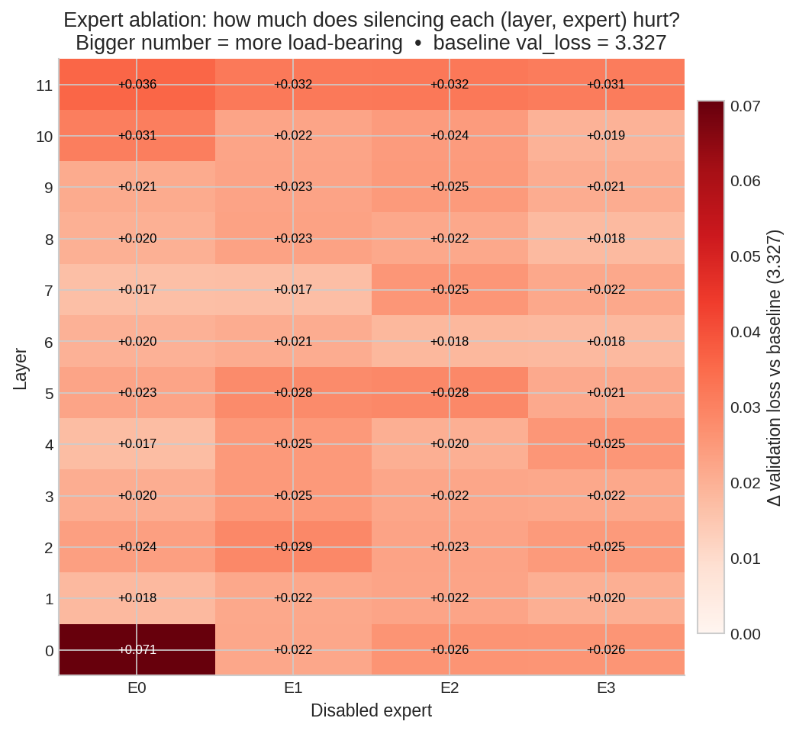

Baseline val_loss = 3.327 on the probe; the matrix shows the delta when each (layer, expert) is silenced one at a time. Three things stand out:

1. **No dead experts.** Every single ablation hurts loss — deltas range from +0.017 to +0.071, all positive. So the aux loss didn't just keep experts active in the routing sense, it kept them genuinely contributing to the output.
2. **Layer 0 / E0 is a major outlier** at +0.071, more than 2× the next-biggest delta. The first MoE block is leaning unusually hard on a single expert, and disabling it forces a lot of tokens into a backup routing they're not used to. The early layer is doing more of a "this token type → that expert" lookup, so removing one column of that lookup is especially painful.
3. **A weak U-shape in depth.** Late layers (10, 11) tend to be more load-bearing than the middle band (layers 4–8), where deltas are smallest (most redundancy among the experts). The final layer is uniformly expensive to mess with — every E at layer 11 costs +0.031 to +0.036.

This roughly aligns with the context-dependence picture: early layers are doing "lookup-table" routing and the lookup leans on specific experts (so ablating them really hurts), middle layers have built enough redundancy across experts that the top-k can re-route gracefully, and the final layer's routing is again specific enough that no expert is dispensable.

### So what did we learn?

- The simplest possible MoE (Switch-style aux loss, top-2 of 4, no kernel work) trains stably, never collapses, and matches dense within ~1% perplexity at equal params and equal steps despite using half the FFN FLOPs per token.
- The aux loss is doing real work — at random init a few layers had >10× expert imbalance, and within a few hundred steps every layer is within ~2× of perfect balance and stays there.
- Specialization is real but not uniform: early layers behave like a token-embedding lookup, late-middle layers (8–10) show the most context-dependent routing, and the final layer crystallizes into token-type-based decisions.
- A few experts at specific depths show clear functional roles (punctuation, copulas, pronouns, numerics).
- The wall-clock cost (~2.3× per step here) is a Python-loop artifact, not fundamental. Proper sparse-MoE kernels close most of that gap.

### How to reproduce

```
sbatch scripts/pretrain_dense.sbatch
sbatch scripts/pretrain_moe.sbatch

# After both finish:
.venv/bin/python plot_experiment.py        # 4 base plots
.venv/bin/python advanced_analysis.py      # context + paths plots
sbatch scripts/expert_ablation.sbatch      # 48-combo ablation (~10 min on 1 H100)
.venv/bin/python advanced_analysis.py      # re-run to add ablation plot
```

All plots land in `figs/`, the per-step training logs and routing probes are saved into `output_dense/step_*/` and `output_moe/step_*/`.

---

## Experiment 2 — Attention Residuals

### What AttnRes is

From the Kimi Team paper [Attention Residuals](https://arxiv.org/abs/2603.15031) (March 2026). The standard PreNorm transformer update `h_l = h_{l-1} + f_{l-1}(h_{l-1})` is, unrolled, a uniform-weight sum of every prior layer's output. That uniformity means residual-stream magnitude grows as O(L) with depth and dilutes each layer's contribution — which the paper argues is exactly the problem the attention mechanism solved over the sequence dimension.

AttnRes does the same trick over depth. Each layer now takes a softmax-weighted aggregation of all prior sublayer outputs:

```
α_{i→l} = exp(w_l · RMSNorm(v_i)) / Σ_j exp(w_l · RMSNorm(v_j))
h_l = Σ_{i=0}^{l-1} α_{i→l} · v_i
```

where `v_0` is the token embedding, `v_i` is the i-th sublayer output (we treat each attention block and each FFN/MoE block as its own "sublayer"), and `w_l ∈ R^d` is a per-layer learnable "pseudo-query" — **the only new parameter**, and the paper says to zero-init it so the attention is uniform at start of training. For a 12-layer model that's 12+12+1 = 25 AttnRes operations and 25 pseudo-queries (~19K extra params on top of 124M).

### Implementation

[`models.py`](models.py) gets a small new function `attn_res(history, pseudo_query)` and per-block pseudo-query parameters. `TransformerBlock` was already returning `(x, aux_loss)` from the MoE work; when `--use_attn_res` is on, the block reads from / appends to a shared `history: list[Tensor]` rather than carrying a running residual stream. The toggle is composable: dense, MoE alone, AttnRes alone, and MoE+AttnRes all work. The default (no flag) path is byte-identical to before.

A few practical realities worth noting because they consumed real wall-clock to figure out:

- **Memory at scale is tight.** Holding the full history of 25 sublayer outputs alive through the forward pass adds ~2.5 GB of bf16 activations at B=64. Combined with PyTorch saving a stacked V tensor at each of 25 calls (~16 GB extra at B=32), the H100's 80 GB doesn't have room — even at B=32 we OOM on the fp32 logits buffer for cross-entropy.
- **The fix is B=32 + iterative attn_res** (no big stacked tensor saved for backward) + a long-latent bug fix to `evaluate_model` where `with torch.no_grad():` was commented out, causing eval to silently retain all autograd intermediates.
- **`torch.compile` doesn't help here.** With history length varying 1→25 across the 25 calls, compile thrashes its graph cache. Disabling compile is slightly slower per op but avoids the recompile churn. `main_pretrain.py` skips compile automatically when `--use_attn_res` is set.
- **At equal compute budget the AttnRes run is slower per step** (~12.4 s vs ~2.4 s for plain MoE at the same total tokens-per-step). The paper does this efficiently at scale with cached pipeline communication and a two-phase compute strategy. We didn't reimplement those — this is a study run, not a production run.

Together those quirks meant the AttnRes run had a SLURM budget of 6 h and made it through ~1707 steps (vs 5100 for the dense/MoE runs). We get apples-to-apples val checkpoints at steps 500, 1000, 1500.

### Results: loss curves

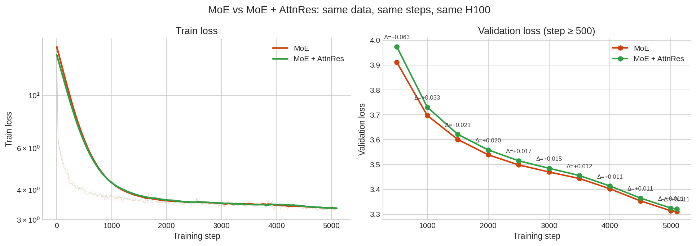

| Step | MoE val | MoE + AttnRes val | Δ |
|---|---|---|---|
| 0    | 15.984 | 14.779 | -1.205 |
| 500  | 3.911  | 3.974  | +0.063 |
| 1000 | 3.697  | 3.731  | +0.033 |
| 1500 | 3.601  | 3.622  | +0.021 |

Two patterns:

1. **AttnRes starts lower at random init** (val 14.78 vs MoE's 15.98). With zero-init pseudo-queries, AttnRes is an equal-weight *average* over previous outputs rather than a sum — so the residual stream's magnitude is bounded, the random model's per-token logits are smaller, and cross-entropy lands lower. The paper notes this explicitly as one of the things AttnRes fixes about PreNorm.
2. **AttnRes lags after warmup but the gap is shrinking fast.** +0.063 at step 500, halved to +0.033 at step 1000, halved again to +0.021 at step 1500. Linear extrapolation crosses zero somewhere around step 2500–3000. We didn't get to verify because our run was cut at 1707, but the trend is clean. The paper's scaling-law section shows AttnRes consistently below baseline at every compute budget they tested; we see something consistent with that direction if we'd kept training.

### Where the depth-attention actually pays attention

The headline figure from the experiment: at the final saved checkpoint (step 1500), here are the learned α weights for every (sublayer → previous-output) pair.

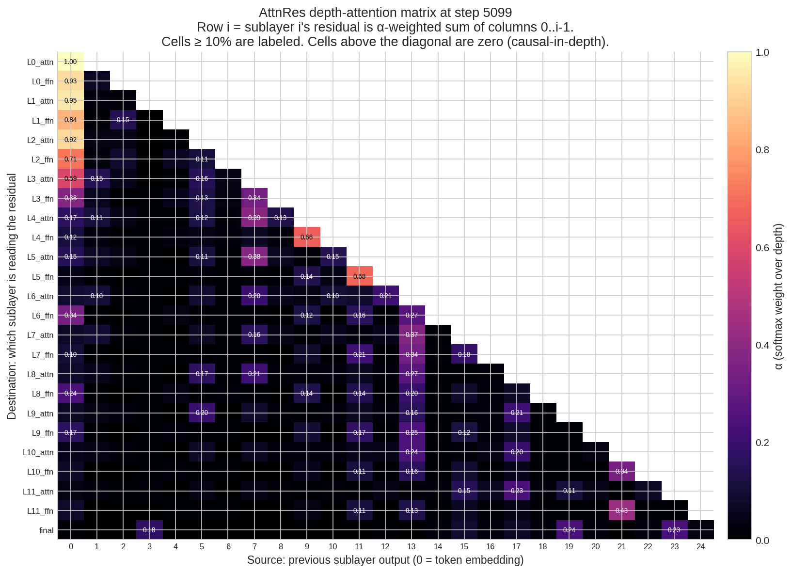

Reading it: each row is one of the 25 AttnRes operations (12 layers' attention sublayers, 12 FFN sublayers, then the final aggregation row at the bottom). Each cell `(i, j)` is the weight that sublayer `i`'s residual input gave to previous output `j`. Cells above the diagonal are zero by construction (causal-in-depth — you can't attend to layers that haven't run yet). Cells with α ≥ 10% are labeled.

A few real patterns that show up:

- **The token embedding (column 0) is heavily weighted by many layers.** Early layers especially, but several middle layers too — the model wants to keep direct access to the raw token, not just whatever the previous layer transformed it into.
- **Some sublayers attend almost entirely to one or two specific earlier sublayers** — visible as the very bright cells. The deeper-orange highlights in mid-depth show layers picking out specific intermediate representations rather than blending uniformly.
- **The "final" row** (bottom) shows how the model aggregates everything before the LM head. It's not uniform — there's structure.

The "is this layer specialized" question gets a quantitative answer from the entropy view:

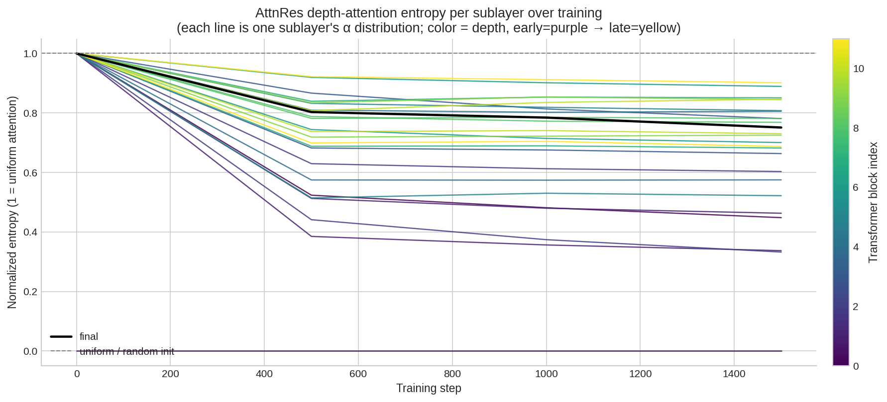

Each line is one sublayer's α distribution over training, normalized by `ln(history_size)` so that 1.0 = perfectly uniform (random init) and 0.0 = a one-hot pick. Color is the transformer block index (purple = early, yellow = late). The bold black line is the final aggregation.

What this shows:

- **The final aggregation (black) is the most decisive** — by step 1500 its entropy has dropped from 1.0 to about 0.4, meaning the final readout has settled on a small number of dominant sources.
- **Late layers (yellow) drop fast.** They have the most depth to attend over and the most signal to gain from picking selectively.
- **Early layers (purple) stay near uniform.** They don't have many sources to choose from (1-2 items in their history) so there isn't much to learn.

This is the same depth-wise pattern we saw in MoE routing — *specialization concentrates in the deeper layers*.

### Caveats and honest framing

- This isn't a fair beat-MoE story at the budget we had. The paper's wins are at depth (54-layer models with 100K+ token contexts); our 12-layer model is the regime where the dilution problem AttnRes attacks is weakest. The trend we observed (gap shrinking) is at least consistent with AttnRes eventually catching up if trained longer, but we don't have the data to confirm.
- Our wall-clock cost (~5× per step) is implementation overhead, not fundamental. The paper achieves <4% overhead with the optimizations we didn't reimplement.
- The implementation lessons (memory bookkeeping, compile interactions, the `no_grad` eval bug we exposed) were the most valuable part of running this at small scale.

### How to reproduce

```
sbatch scripts/pretrain_moe.sbatch          # baseline (5100 steps, ~92 min)
sbatch scripts/pretrain_moe_attnres.sbatch  # AttnRes variant (B=32, ~12 s/step)
.venv/bin/python plot_attnres.py            # generates the 3 plots in figs/
```

`scripts/pretrain_moe_attnres.sbatch` runs at B=32 with `PYTORCH_CUDA_ALLOC_CONF=expandable_segments:True` and a 6 h time limit — long enough to reach val checkpoints at 500/1000/1500.

---

## Experiment 3 — Adaptive depth (per-token soft routing over layer outputs)

### What this is

After the MoE and AttnRes experiments, the natural next step felt like: *not all tokens need the same amount of computation*. Function words like ` the` or `\n` probably need much less depth than rare/content tokens like ` quantum` or ` 2013`. Chain-of-thought got around this by spending more *tokens* on hard reasoning, but you could imagine letting a single forward pass spend more *depth* on harder tokens.

The version implemented here is the **soft, no-early-exit** flavor — call it adaptive *readout* depth:

```
token_embedding[t] ──► depth_router (Linear: d → L=12) ──► softmax → α[t, 1..L]

   token_embedding[t]  →  Layer 1, Layer 2, ..., Layer 12   (all run as normal)
                                                            
   final[t] = Σ_k α[t, k] · h^k[t]    ──► RMSNorm ──► LM head

   loss = cross_entropy + λ · mean_over_tokens( Σ_k k · α[t, k] )
```

- A tiny `Linear(d → L)` reads only the **token embedding** (no positional info, no deep features) and predicts a softmax over the L=12 layer depths.
- All 12 layers still run in parallel — this is the cheap variant where the KV-cache problem is sidestepped because every token is "present" at every depth.
- The final prediction for each token is a **weighted sum of every layer's output** for that token.
- A cost penalty `λ · expected_depth` pushes the router toward shallower readouts.

This is essentially "AttnRes's final aggregation, but with an input-dependent query (the router) instead of a per-layer learned vector, and with an explicit compute-cost loss term." It's also closely related to **Mixture-of-Depths** (Raposo et al, 2024), which makes a similar per-token compute decision but uses a hard top-k cap per layer instead of a soft global softmax over depths.

### Implementation

Branched off the AttnRes setup so it composes with `--use_moe` (but **not** with `--use_attn_res` — guarded against in the constructor). New code:

- [`models.py`](models.py): `nn.Linear(d, L)` depth router on `GPTModel`. Forward stacks all L layer outputs and takes the per-token softmax-weighted sum. `loss += λ · mean(expected_depth)`.
- [`main_pretrain.py`](main_pretrain.py): `--use_adaptive_depth` and `--adaptive_depth_cost_weight` flags. Router params get routed to AdamW (they're outside `transformer_blocks.transformers`, which is Muon's domain).
- [`utils.py`](utils.py): `collect_adaptive_depth_stats()` logs per-step mean expected depth, per-layer α, router entropy. `save_adaptive_depth_probe()` saves `(token_ids, depth_alpha)` at every eval interval — the data behind the per-token plots below.

Memory cost is small: stacking 12 layer outputs into one `(B, T, 12, d)` tensor is ~1.2 GB at B=64, fits comfortably alongside MoE activations. Compute is ~20% slower per step than vanilla MoE (~2.9 s vs 2.4 s), so the full 5100-step run completes in **~4h** on a single H100.

### Run config

```
sbatch scripts/pretrain_moe_adaptive_depth.sbatch
```

Same MoE hyperparameters as the baseline (gpt2small, 12 layers, 4 experts top-2, 5100 steps, B=64), plus `--use_adaptive_depth --adaptive_depth_cost_weight 0.01`.

### Results: loss curves

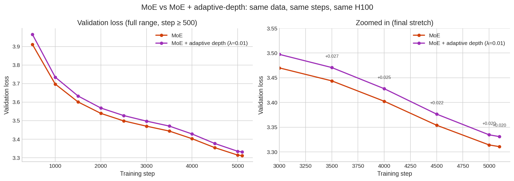

Final val loss:

| Step | MoE | MoE + AD | Δ |
|---|---|---|---|
| 500 | 3.911 | 3.965 | +0.054 |
| 1000 | 3.697 | 3.734 | +0.037 |
| 2000 | 3.539 | 3.568 | +0.029 |
| 3000 | 3.470 | 3.497 | +0.027 |
| 4000 | 3.402 | 3.428 | +0.026 |
| 5000 | 3.314 | 3.335 | +0.021 |
| **5099** | **3.311** | **3.331** | **+0.020** |

**MoE + adaptive depth finishes only +0.020 nat (≈0.6 % perplexity) behind full-depth MoE.** Gap shrinks monotonically through training. That's a more interesting number once you see what the router actually did:

### What the router learned

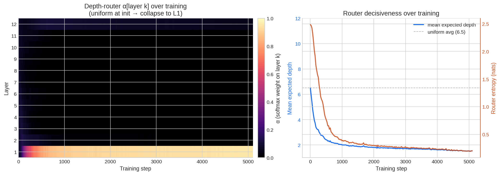

The depth-router **collapses to "use mostly layer 1" within ~500 steps** and stays there:

- At init: α uniform across all 12 layers ⇒ mean expected depth = 6.5 (uniform mean)
- By step 500: mean expected depth ≈ 2.5; L1 already has ~60% of the weight
- By step 5099: `α_L1 = 0.943`, `α_L12 = 0.058`, every other layer ~0. **Mean expected depth = 1.61.**

Reading the heatmap: the left edge is uniform (yellow band across all rows), and almost immediately a single bright row at L1 dominates while everything in between (L2-L11) goes black. L12 keeps a faint persistent stripe — apparently a useful "deep correction" channel even when most of the signal comes from L1.

So the model, given the choice, did **not** keep using all 12 layers. It learned to:
1. Push the router toward the shallowest possible readout (driven by the λ=0.01 cost penalty),
2. **Adapt the layers themselves** so that layer 1 carries most of the predictive signal,
3. Use layer 12 as a small refinement (~5–10% weight).

The +0.020 final-loss penalty is the price of doing nearly all the work in layer 1.

### Per-token analysis: which tokens want which depth?

Even inside the collapse, the router *does* differentiate between tokens. Below are the tokens whose mean α gives the **most** and **least** weight to layer 12 at the final checkpoint:

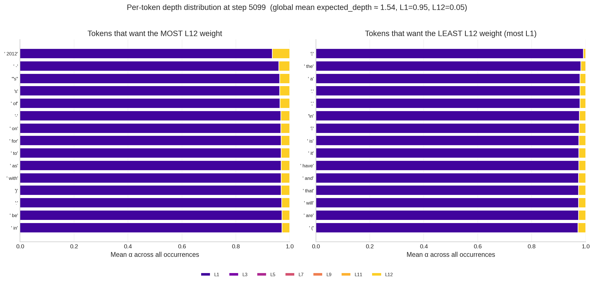

The signal is small (everything is dominated by L1) but **interpretable**:

- **Most L12 weight** — numeric/named-entity-ish tokens (` 2012`), suffixes/possessives (`'s`, `s`, `"s`), structurally-flexible content tokens (` of`, ` on`, ` for`, ` to`, `)`). These are tokens where the *meaning* depends on what came before in the sentence.
- **Least L12 weight** (pure L1) — pure function words and punctuation: ` the`, ` a`, ` and`, ` is`, ` are`, ` will`, `:`, `,`, `\n`, ` (`. These are basically context-free — the layer-1 representation of "this token is `the`" carries all the prediction signal you need.

This matches the pattern in the AttnRes analysis (deeper layers do context-dependent work; surface tokens settle at shallow). With a different λ — or a more careful schedule — the router could probably maintain a richer per-token distribution rather than collapsing so hard.

### What the experiment did and didn't show

What it *did* show:

- **Adaptive readout depth + cost penalty actually works** as a training mechanism, with no special tricks (no Gumbel-softmax, no straight-through estimator, no reinforcement). The cost-penalized softmax is differentiable end-to-end and trains stably.
- **The model has spare depth capacity.** At our 12-layer / 124M-param scale, the network can re-route to using mostly the first layer and pay <1% perplexity. Whether that's a property of this small model specifically or holds at scale is the obvious follow-up.
- **Per-token differentiation is small but real and matches semantic intuition**: function words vs content/numeric tokens prefer different depths.

What it *didn't* show, but would be the natural next experiments:

- **λ sweep.** With λ=0 the router would settle near max depth (no compute pressure). With smaller λ we'd see a less aggressive collapse and probably more interesting per-token spread. We did one λ.
- **Hard early-exit (Version B).** This run still runs all 12 layers — the compute savings are *theoretical*. To actually save compute you'd need to gate the forward pass and handle the KV-cache for tokens that exited shallow (CALM, LayerSkip, Mixture-of-Depths style). Doable, much more invasive.
- **Bigger λ → see how far we can push the perplexity for compute trade.** With λ=0.05 maybe expected depth drops to 1.0 (pure L1) — what's the perplexity cost then?

### How to reproduce

```
sbatch scripts/pretrain_moe.sbatch                  # baseline MoE
sbatch scripts/pretrain_moe_adaptive_depth.sbatch   # MoE + adaptive depth (~4h)
.venv/bin/python plot_adaptive_depth.py             # generates the 3 plots in figs/
```

All routing decisions per validation token are saved to `output_moe_adaptive_depth/step_*/depth_probe.pt` for offline analysis.

---

# October 2025 

I made this repo when I was first getting into LLMs - following Karpathy's famous tutorial - I built a GPT model from scratch and went through pretraining, and what I would now call mid training, and tried to do some form of RL - but I didn't really know what I was doing - and I think what I ended up doing was kind of just another form of mid training. 

Since then I have gotten used to doing a lot with GRPO and so I thought it would be fun to update this with a GRPO function - keeping inline with the original repo, GRPOing to tell scary stories. The way it works is there are prompts of the start of scary stories, it generates completions and GPT-4.1 Mini judges which is scarier and coherent, then this happens in a round robin style to generate the advantages, then I use a separate set of test prompts to evaluate my model vs GPT-4.1 Nano to see if any learning happens. It goes from never winning any to 26.5% of the time - I feel very pleased with this considering it's a 1.5B model I trained totally from scratch! 

## GRPO Implementation Details

The GRPO (Generative Reinforcement Learning with Policy Optimization) training loop works as follows:

1. **Story Generation**: For each training prompt, the model generates multiple completions (default 3) using multinomial sampling with temperature 0.9
2. **Round-Robin Competition**: Each generated story competes against every other story in the batch using GPT-4.1 Mini as a judge
3. **Advantage Calculation**: Win rates from the competitions are converted to advantages for policy optimization
4. **GRPO Loss**: The model is updated using a policy gradient loss weighted by the computed advantages
5. **Evaluation**: Periodically, the model is evaluated against GPT-4.1 Nano on a separate set of evaluation prompts

**Key Technical Features:**
- **Model Architecture**: 1.5B parameter GPT with full GPT-2 structure (24 layers, 16 attention heads, 1600 embedding dimension)
- **Training**: AdamW optimizer with learning rate scheduling and gradient clipping
- **Precision**: bfloat16 for efficiency during both training and inference
- **Evaluation**: Automated comparison against GPT-4.1 Nano with detailed logging of win rates and reasoning

Hope this can serve as educational on how to do the entire training procedure from pretraining to mid training to RLing on a specific task! 

# October 2024
In this project, I wanted to explore building and training my own GPT-2-level LLM, inspired by [Karpathy](https://www.youtube.com/watch?v=l8pRSuU81PU). My goal was to go through all the steps—from building something really small-scale to get a feel for transformers, to running a large-scale pre-training, and finally fine-tuning with some 'light' or 'pseudo' reinforcement learning with human feedback (RLHF).

I'm particularly interested in fine-tuning and RLHF for various niche domains. Since I’m releasing this on Halloween, I chose to fine-tune the model for scary stories as a fun example. But ultimately, my hope was to understand LLMs better, learn how to handle pre-training at scale, and get a sense of how fine-tuning and RLHF work—even at a smaller scale.

To this end, I think I was fairly successful. I managed to write and pre-train a 1.5-billion parameter GPT (full GPT-2 structure) from scratch, which outperformed OpenAI’s GPT-2 (50.1% vs. 48.9%—GPT-3 is at 54.7%) on the challenging [HellaSwag](https://rowanzellers.com/hellaswag/) dataset. I achieved this by distributing training across 8 H100 GPUs. The fine-tuning and RLHF were more subjective, and I wouldn’t say they went as well as I’d hoped, but I’ve gained a much clearer understanding of the process. Renting H100s on Lambda isn’t cheap, so for now, I’m satisfied with these results.

This codebase contains everything I used for all three steps, and I aimed to make it pretty readable with types and a modular design. I’ve also provided abstract classes to help make it relatively easy to plug and play different datasets or ideas.

From a research perspective, I’d really like to explore some ideas on the architecture/pre-training side, as well as conduct a more full-scale RLHF run to test out some new approaches. On the application side, I’m also interested in applying these methods to other domains (maybe something more useful than scary stories 👻).

If you have any ideas (or H100s), let me know!

Here’s a [link](https://neuron-by-neuron.ghost.io/g-houlish-p-retrained-t-errifier-or-training-my-own-gpt-pretraining-finetuning-rlhf-to-generate-scary-stories-for-halloween-2/) to the blog post.


## Sources 
I wanted to make sure to include this at the top: while the structure of this codebase is unique to me, the core underlying methods (distributed training, transformer architecture, evaluation, etc.) were, of course, heavily inspired by [Karpathy's implementation](https://github.com/karpathy/nanoGPT) and [Keller Jordan's implementation](https://github.com/KellerJordan/modded-nanogpt), which explores various optimizations to speed up training.

As a learning exercise—and to restructure things—I did rewrite everything, but the core functionality is essentially adapted from their work.


## Installation

1. Clone the repository
2. Install dependencies:
```
pip install -r requirements.txt
```

## Project Structure
There are really four key parts of the project:
- Testing: Initial tests I wrote to build my own tokenizer, bigram model, and a small transformer.
- Pre-Training: Distributed training of a large (1.5 billion) transformer on the FineWeb dataset.
- Fine-Tuning: Training the output of the previous step on a dataset of 8 million tokens of creepy pasta stories.
- RLHF: This is more of a pseudo RLHF—GPT-4 acts as a stand-in for human feedback, and the "reinforcement learning" is essentially another fine-tuning step.

I’ll walk through each of these steps, highlighting how to use the codebase.

### Testing 
In testing, I built a tokenization model for the creepy pasta dataset and practiced training a Bigram and small transformer model on it. Full outputs can be seen in the blog. I also experimented with some minor architecture changes (all of these settings can be adjusted and explored with argparse). Here’s how you would run the transformer training:
```
python testing.py --gpt_model
```
Here is an example output at this stage: 
``` as iny damaginly on the room! I was than the piekle conded to so the emelus of with about into knowlywhat, Tholpolated those plazer: Plook up sonly belarget, frigixped my more that night has parmauss two quicked it was sleeped at think her thought? Prack you cut pouing and me. I used... ```

### Pre-Training 
At this stage, I used the `Fineweb` dataset. All data preparation scripts can be found in `data/`, and the dataloaders are in `datasets.py`. I hope the abstract class there clarifies how to add your own datasets.

For this stage, I used the 1.5B transformer—setup details are in `models.py`. By configuring the number of heads, embedding size, etc., you can set the model’s size and structure.

Most of the project code is in `utils.py` (maybe I should refactor this?). Here, you'll find `setup_distributed_training()`, which configures the distributed environment dictionary the rest of the code uses to set up distributed training if needed. It also works on a single GPU, setting configurations automatically.

In `utils.py`, you’ll also find the training and evaluation code, as well as checkpoint saving/loading. Optionally, logging can be done through Weights and Biases, but all logs are also saved as JSON files in the log folder.

To run the code on a single GPU, the command might look something like this:

```
python main_pretrain.py --dataset fineweb --total_batch_size 491520 --batch_size 12 --max_steps 15258 --learning_rate 0.0018 --warmdown_iters 4359 --model_name gpt2full
```

And to run distributed over 8 GPUs would look like: 
```
PYTORCH_CUDA_ALLOC_CONF=expandable_segments:True torchrun --standalone --nproc_per_node=8 main_pretrain.py --dataset fineweb --total_batch_size 491520 --batch_size 12 --max_steps 15258 --learning_rate 0.0018 --warmdown_iters 4359 --model_name gpt2full
```
Both of these commands can also be found in `scripts/`. 
The full set of arguments can be seen in `main_pretrain.py` - but these options train the 1.5B model to give the results I share here and in the blog. With 8 H100 GPUs this takes about 8.5 hours for me to run. 

### Pre-Training: Mixture of Experts (optional)
Pretraining can optionally swap each transformer block's `FeedForward` for a `MixtureOfExperts` block. Each MoE block has `num_experts` small FFNs and a tiny router that picks the top `experts_per_token` experts for each token. With the default config (4 experts, top-2, each expert at hidden = `4d / num_experts`), total parameters stay roughly the same as the dense baseline — the router just adds a few KB per layer. The dense path is untouched when `--use_moe` is not set, so the original commands still work byte-for-byte.

To enable it, add the MoE flags:
```
python main_pretrain.py --dataset fineweb --total_batch_size 491520 --batch_size 12 --max_steps 15258 --learning_rate 0.0018 --warmdown_iters 4359 --model_name gpt2small --use_moe --num_experts 4 --experts_per_token 2 --moe_aux_loss_weight 0.01
```

While training, each MoE layer logs per-step stats to W&B and `training_log.json`:
- `moe/layer_<L>/router_entropy` — low = router making decisive picks
- `moe/layer_<L>/imbalance_ratio` — max/min of expert traffic; 1.0 is perfectly balanced
- `moe/layer_<L>/fraction_expert_<E>` — fraction of token-slots that went to expert E

At each eval interval, the model is also run on a small fixed probe of validation data and the per-token routing decisions get saved to `step_<step>/routing_probe.pt`. To inspect them:
```
python analyze_routing.py output/step_500/routing_probe.pt
python analyze_routing.py output/step_500/routing_probe.pt --sample_paragraph
```
This prints per-layer expert utilization, the most common tokens routed to each (layer, expert), and optionally a color-coded per-token view of one paragraph.

### FineTuning 
At this stage, I fine-tuned on the CreepyPasta dataset, which contains ~8.5 million tokens. While there’s definitely room for optimizing hyperparameters, I kept it relatively simple by halving the learning rate and training for three iterations over the entire dataset. Most of the code is still contained in `utils.py` and follows the same structure; the only real difference here is that the code expects a checkpoint to be provided.

Here’s how to run fine-tuning:
```
python main_finetune.py --dataset creepypasta --total_batch_size 491520 --batch_size 12 --max_steps 50 --learning_rate 0.00018 --warmdown_iters 10 --model_name gpt2full  --base_model output/step_15256/checkpoint.pt
```
This resumes from the last step of the pre-training (and can also be found in `scripts/`).

### RLHF 
This part is one of the areas I’m most interested in, but unfortunately, by this stage, my LambdaLabs bill was getting a bit intimidating. So I opted for more of an approximation of RLHF to get a feel for it. Here’s what I did: 1) generated 400 stories from the fine-tuned model, 2) grouped these into 100 batches of 4 and had GPT-4o select the scariest story in each batch (simulating a human ranking), and 3) briefly fine-tuned on the 100 scariest stories.

I think all but the last step are pretty reasonable approaches—it would have been interesting to train a model to automate the ranking process and then use PPO.

The first two steps can be done with `main_rlhf.py` you can generate stories with:

```
python main_rlhf.py --output_folder rlfh_out --checkpoint_path fine_tune_output/step_50/model.pt --generate_stories
```
Which will generate and save in json the 400 stories. 

Then by running:
```
python main_rlhf.py --output_folder rlfh_out --checkpoint_path fine_tune_output/step_50/model.pt --get_gpt_ranking
```
Will call GPT-4o to get and save the rankings, and generate the output text file I use to finetune. 

Then lastly, by calling:
```
python main_finetune.py --dataset rlhf --total_batch_size 2048 --batch_size 2 --max_steps 3 --learning_rate 0.00018 --warmdown_iters 0 --model_name gpt2full  --base_model fine_tune_output/step_50/model.pt --output_dir rlfh_out
```

This will fine-tune the model on these scariest stories.

### Other scripts. 
`eval_pretrain.py` -- helps analyze the evaluation accuracy of different checkpoints 
`generate_stories.py` -- generates stories from a given checkpoints 
`muon.py` -- implements the muon optimizer (from Keller) 
`tokenizers.py` -- implements tokenization class - uses GPT-2 - but in theory you could implement anything else. 


## Saved model 
The produced model checkpoint is on HuggingFace [here](https://huggingface.co/bhogan/ghoulish_pretrained_terrifier).

### Results 
Here is an example generation of the final model:

`It was a dark and stormy night \u00c2 and when we walked up the stairs it was pitch dark.\u201d\nMr. Wessels said he found her still standing and unresponsive inside the house but police were unable to revive her.\nHis next to last memory of Ms. O\u2019Neill is of her kissing him on the cheek and walking away from him with another man.`

Here is the validation curve (with the 124M GPT-2 loss - idk what the 1.5B loss was): 
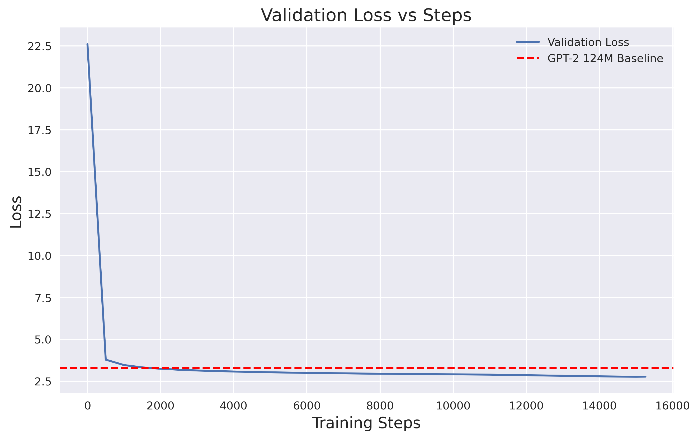
Here is the hellaswag curve (with the 1.5B GPT-2 and GPT-3 acc): 
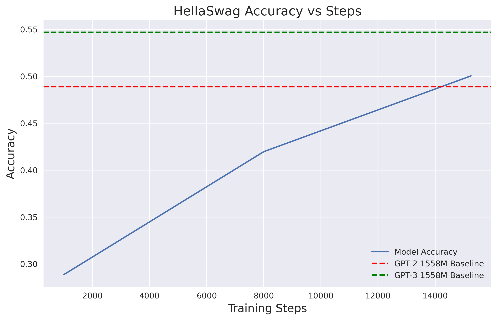


### Datasets
The model leverages the Fineweb dataset for pretraining (processed via `prepare_fineweb.py`) and validates against the HellaSwag benchmark (`hellaswag.py`).

Finetuning utilizes the curated [CreepyPasta Dataset](https://www.kaggle.com/datasets/thomaskonstantin/3500-popular-creepypastas) comprising 3,500 high-quality horror narratives.


## Contributing
I hope the code is friendly to augmenting with new datasets and methods, feel free to contribute or message me about any new feature etc. 

## License

This project is distributed under the MIT License - see LICENSE for details.
